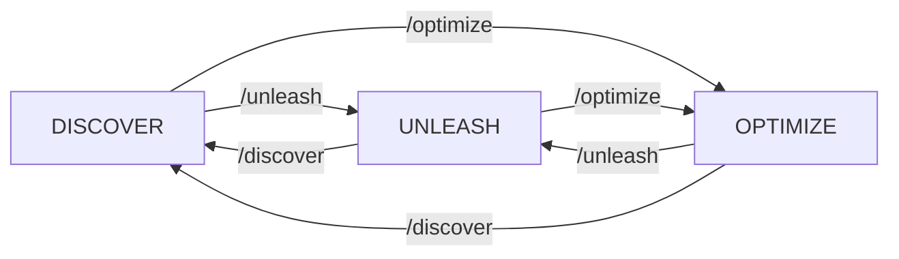

# Cohesion Slash Commands

Cohesion uses Claude Code's native slash command API for reliable mode control.

## Available Commands

### Mode Control

#### `/discover [context]`
Switch to DISCOVER mode for analysis and planning.
- **Tools:** Read-only access (Read, Grep, Glob, safe Bash)
- **Purpose:** Understand before building
- **Optional context:** Add focus area (e.g., `/discover authentication`)

#### `/optimize [context]`
Switch to OPTIMIZE mode for collaborative development.
- **Tools:** Read + Write/Edit (with approval)
- **Purpose:** Work together with guardrails
- **Requirement:** Use `/approve` before editing files

#### `/unleash [context]`
Switch to UNLEASH mode for autonomous development.
- **Tools:** Full access, no restrictions
- **Purpose:** Build rapidly with complete freedom
- **Use when:** Plan is clear and you're ready to execute

### File Management (OPTIMIZE mode)

#### `/approve <file|pattern>`
Approve files for editing in OPTIMIZE mode.
- **Single file:** `/approve src/index.js`
- **Pattern:** `/approve src/*.js`
- **All files:** `/approve *` (use carefully)

#### `/list-approvals`
Show currently approved files.

#### `/clear-approvals`
Remove all file approvals.

### Session Management

#### `/save [context]`
Save session context and update project documentation.
- **Session checkpoint:** Preserves current work state
- **Documentation update:** Updates STATE.md and daily logs
- **Mode awareness:** Maintains current DISCOVER/OPTIMIZE/UNLEASH mode
- **Git integration:** Tracks modified files automatically
- **Future:** `/save --milestone` for comprehensive Close-the-Loop analysis

### Status & Help

#### `/status`
Check current mode and session state.
- Shows active mode
- Lists approved files (if in OPTIMIZE)
- Displays session context

#### `/help`
Show available commands and current mode capabilities.

## Command Arguments

Commands accept optional arguments for context:
```
/discover authentication system
/optimize refactor the database layer
/unleash implement caching with Redis
```

This context is preserved and shown in subsequent prompts.

## Mode Transitions



## Examples

### Feature Development Flow
```bash
/discover user authentication    # Analyze existing auth
# ... exploration and planning ...
/save "Analysis complete, ready for implementation"
/unleash implement OAuth         # Build the feature
# ... rapid development ...
/save "OAuth implementation complete and tested"
/discover                        # Review what was built
```

### Collaborative Refactoring
```bash
/optimize refactor API layer     # Enter collaborative mode
/approve src/api/*.js           # Approve API files
# ... make changes with oversight ...
/save "API refactoring phase 1 complete"
/list-approvals                 # Check what's approved
/clear-approvals               # Reset approvals
```

### Quick Bug Fix
```bash
/unleash fix login timeout      # Jump straight to fixing
# ... implement fix ...
/save "Login timeout bug fixed and tested"
/discover                       # Back to analysis
```

## Implementation

Commands are implemented as shell scripts in `.claude/commands/`:
- Simple, reliable execution
- Direct state file manipulation
- Clear user feedback
- Session context preservation

## Troubleshooting

**Command not found?**
- Check `.claude/commands/` exists
- Ensure scripts are executable: `chmod +x .claude/commands/*.sh`

**Mode not changing?**
- Check state files: `ls .claude/state/`
- Only one mode file should exist

**Approvals not working?**
- Must be in OPTIMIZE mode first
- Check `.claude/state/.approved_edits`

## Best Practices

1. **Always start with `/status`** - Know your current state
2. **Use context arguments** - Helps AI understand your focus
3. **Clear approvals regularly** - Keep OPTIMIZE mode clean
4. **Return to DISCOVER** - Periodically reassess your approach
5. **Document mode switches** - Explain why you're changing modes

---

*Slash commands provide reliable, deterministic control over Cohesion modes.*