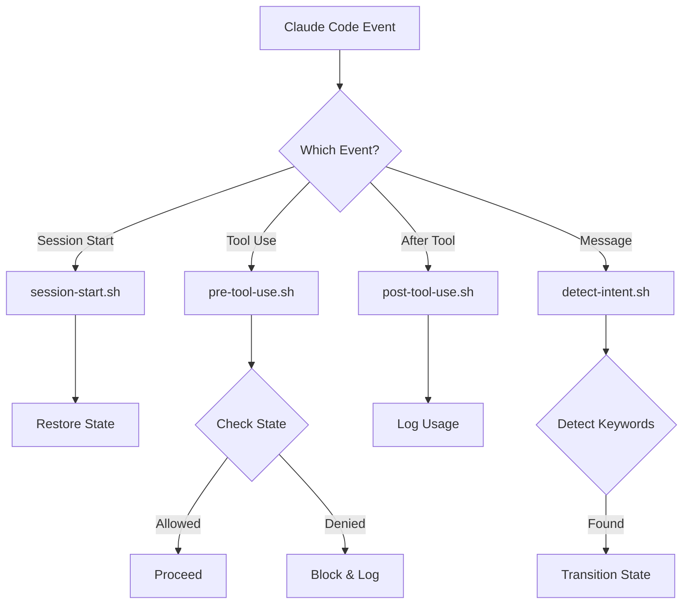

# 🪝 Cohesion Hooks System

> Understanding how Cohesion controls Claude through hooks

## Overview

Cohesion uses **Claude Code's native hook system** to intercept and control AI actions. Hooks are bash scripts that run at specific points in the Claude Code lifecycle, enabling state-based permission control.

## Architecture

```
Claude Code Event → Hook Triggered → State Checked → Action Allowed/Denied
```

### Hook Flow Diagram



## Core Hooks

Cohesion uses 8 hooks that map to Claude Code events:

| Hook File | Claude Event | Purpose |
|-----------|--------------|---------|
| session-start.sh | SessionStart | Initialize state at session start |
| session-end.sh | SessionEnd | Save state when session ends |
| pre-tool-use.sh | PreToolUse | Control tool access based on state |
| bash-validator.sh | PreToolUse (Bash) | Additional validation for bash commands |
| post-tool-use.sh | PostToolUse | Track tool usage statistics |
| detect-intent.sh | UserPromptSubmit | Listen for state-change keywords |
| save-progress.sh | Stop | Save work when interrupted |
| pre-compact.sh | PreCompact | Preserve state before token cleanup |

### 1. session-start.sh (SessionStart)

**Purpose**: Initialize or restore session state

**Trigger**: Claude Code session begins

**Key Functions:**
```bash
# Restore previous state if exists
if [ -f "$STATE_FILE" ]; then
  restore_state
else
  initialize_state "DISCOVER"
fi

# Log session start
log_event "SESSION_START"

# Set up environment
export COHESION_SESSION_ID="$(generate_id)"
```

**Performance**: <5ms typical

### 2. pre-tool-use.sh (PreToolUse)

**Purpose**: Control tool access based on state

**Trigger**: Before any tool execution

**Input Format:**
```json
{
  "tool_name": "Write",
  "arguments": {
    "file_path": "/path/to/file",
    "content": "file content"
  }
}
```

**Decision Logic:**
```bash
case "$STATE" in
  DISCOVER)
    case "$TOOL" in
      Write|Edit|MultiEdit)
        deny_tool "Cannot modify in DISCOVER"
        ;;
      Read|Grep|Glob)
        allow_tool
        ;;
    esac
    ;;
  UNLEASH)
    allow_tool  # All tools permitted
    ;;
  OPTIMIZE)
    deny_tool "No tools in OPTIMIZE state"
    ;;
esac
```

**Performance**: <10ms typical

### 3. post-tool-use.sh (PostToolUse)

**Purpose**: Log tool usage and update metrics

**Trigger**: After tool execution completes

**Functions:**
```bash
# Log tool usage
log_tool_usage "$TOOL" "$STATE" "$RESULT"

# Update statistics
increment_counter "${TOOL}_${STATE}"

# Check for state triggers
if task_complete; then
  transition_state "DISCOVER"
fi
```

**Performance**: <5ms typical

### 4. detect-intent.sh (UserPromptSubmit)

**Purpose**: Detect state transition keywords

**Trigger**: User message processed

**Pattern Matching:**
```bash
detect_approval() {
  case "$MESSAGE" in
    *approved*|*lgtm*|*proceed*)
      return 0 ;;
    *)
      return 1 ;;
  esac
}

detect_distress() {
  case "$MESSAGE" in
    *stuck*|*help*|*blocked*)
      return 0 ;;
    *)
      return 1 ;;
  esac
}
```

**Performance**: <10ms typical

### 5. save-progress.sh (Stop)

**Purpose**: Periodic state persistence

**Trigger**: Interval or significant events

**Functions:**
```bash
# Save current state
save_state_to_json

# Backup if needed
if should_backup; then
  create_backup
  cleanup_old_backups
fi

# Update duration metrics
update_state_duration
```

### 6. session-end.sh (SessionEnd)

**Purpose**: Save state when Claude session ends

**Trigger**: Claude Code session terminates

**Key Functions:**
- Save current state to disk
- Log session duration
- Clean up temporary files

### 7. bash-validator.sh (PreToolUse for Bash)

**Purpose**: Additional validation for bash commands

**Trigger**: PreToolUse event when tool is "Bash"

**Key Functions:**
- Check if bash command modifies files
- Validate against state permissions
- Block dangerous commands in DISCOVER state

### 8. pre-compact.sh (PreCompact)

**Purpose**: Preserve state before token limit cleanup

**Trigger**: Claude approaches token limit

**Key Functions:**
- Save critical state information
- Preserve work context
- Prepare for session continuation

## Hook Configuration

### settings.json Structure

```json
{
  "hooks": {
    "sessionStarted": [
      {
        "matcher": "*",
        "hooks": [
          {
            "type": "command",
            "command": "$CLAUDE_PROJECT_DIR/.claude/hooks/session-start.sh"
          }
        ]
      }
    ],
    "preToolUse": [
      {
        "matcher": "*",
        "hooks": [
          {
            "type": "command",
            "command": "$CLAUDE_PROJECT_DIR/.claude/hooks/pre-tool-use.sh",
            "input": "json"
          }
        ]
      }
    ],
    "postToolUse": [
      {
        "matcher": "*",
        "hooks": [
          {
            "type": "command",
            "command": "$CLAUDE_PROJECT_DIR/.claude/hooks/post-tool-use.sh"
          }
        ]
      }
    ],
    "userPromptReceived": [
      {
        "matcher": "*",
        "hooks": [
          {
            "type": "command",
            "command": "$CLAUDE_PROJECT_DIR/.claude/hooks/detect-intent.sh"
          }
        ]
      }
    ]
  }
}
```

### Environment Variables

Hooks have access to:
```bash
$CLAUDE_PROJECT_DIR    # Project root
$CLAUDE_TOOL_NAME      # Current tool
$CLAUDE_SESSION_ID     # Session identifier
$CLAUDE_USER_MESSAGE   # User input
$COHESION_STATE        # Current state
$COHESION_STATE_DIR    # State directory
```

## Hook Implementation Details

### Input/Output Contract

**Input Methods:**
1. **Environment variables** - Simple data
2. **JSON via stdin** - Complex data
3. **Command arguments** - Flags and options

**Output Requirements:**
- **Exit 0** - Allow action
- **Exit 1** - Deny action
- **Stdout** - Logged messages
- **Stderr** - Error messages

### Error Handling

```bash
#!/bin/bash
set -euo pipefail  # Strict mode
trap 'handle_error $?' ERR

handle_error() {
  echo "ERROR: Hook failed with code $1" >&2
  # Fail safe - deny action on error
  exit 1
}
```

### Performance Optimization

**Techniques Used:**
```bash
# 1. Avoid subshells
STATE=$(cat file)  # Slow
STATE=$(<file)     # Fast

# 2. Use built-ins
if [[ "$var" =~ pattern ]]; then  # Fast regex
if echo "$var" | grep pattern; then  # Slow

# 3. Early returns
[[ "$STATE" == "UNLEASH" ]] && exit 0  # Skip checks

# 4. Minimal file I/O
# Append instead of rewrite
echo "$log_entry" >> log.txt

# 5. JQ optimization
# Single pass extraction
eval $(jq -r '@sh "TOOL=\(.tool_name) PATH=\(.path)"')
```

## Creating Custom Hooks

### Step 1: Create Hook Script

```bash
#!/bin/bash
# .claude/hooks/custom-hook.sh

# Get input
INPUT=$(cat)
TOOL=$(echo "$INPUT" | jq -r '.tool_name')

# Your logic here
if should_allow_tool "$TOOL"; then
  exit 0
else
  echo "Tool $TOOL denied by custom hook" >&2
  exit 1
fi
```

### Step 2: Register in settings.json

```json
{
  "hooks": {
    "customEvent": [
      {
        "matcher": "*",
        "hooks": [
          {
            "type": "command",
            "command": "$CLAUDE_PROJECT_DIR/.claude/hooks/custom-hook.sh"
          }
        ]
      }
    ]
  }
}
```

### Step 3: Make Executable

```bash
chmod +x .claude/hooks/custom-hook.sh
```

## Hook Patterns

### Pattern 1: Conditional Tool Access

```bash
# Allow Write only for specific files
if [[ "$TOOL" == "Write" ]]; then
  FILE=$(echo "$INPUT" | jq -r '.file_path')
  if [[ "$FILE" =~ ^/allowed/path/ ]]; then
    exit 0
  fi
fi
```

### Pattern 2: Time-Based Restrictions

```bash
# No modifications after 6 PM
HOUR=$(date +%H)
if [ "$HOUR" -ge 18 ] && [[ "$TOOL" =~ ^(Write|Edit)$ ]]; then
  deny_tool "No modifications after 6 PM"
fi
```

### Pattern 3: Rate Limiting

```bash
# Limit tool usage rate
COUNT=$(get_tool_count "$TOOL" "last_minute")
if [ "$COUNT" -gt 10 ]; then
  deny_tool "Rate limit exceeded for $TOOL"
fi
```

### Pattern 4: Multi-State Logic

```bash
# Complex state machine
case "${STATE}_${TOOL}" in
  DISCOVER_Read|DISCOVER_Grep)
    allow ;;
  UNLEASH_*)
    allow ;;
  REVIEWING_Read|REVIEWING_Write)
    allow ;;
  *)
    deny ;;
esac
```

## Debugging Hooks

### Enable Debug Mode

```bash
# In hook script
# Add debug output to any hook
DEBUG=0  # Set to 1 for debug mode
[[ "$DEBUG" == "1" ]] && set -x

# Or add debug output directly
echo "DEBUG: State is $STATE" >&2
```

### Test Hooks Manually

```bash
# Test pre-tool-use hook
echo '{"tool_name":"Write","path":"/test"}' | \
  .claude/hooks/pre-tool-use.sh

# Check exit code
echo $?  # 0=allowed, 1=denied
```

### Monitor Hook Activity

```bash
# Watch all hook logs
tail -f .claude/state/*.log

# Filter specific hook
tail -f .claude/state/tool-usage.log | grep Write

# Real-time state changes
watch -n 1 'tail -10 .claude/state/history.log'
```

### Common Issues

**Issue**: Hook not firing
```bash
# Check executable
ls -l .claude/hooks/*.sh

# Verify registration
cat .claude/settings.json | jq '.hooks'

# Test directly
bash -n .claude/hooks/pre-tool-use.sh  # Syntax check
```

**Issue**: Hook too slow
```bash
# Profile hook
time .claude/hooks/session-start.sh

# Add timing
START=$(date +%s%N)
# ... hook code ...
END=$(date +%s%N)
echo "Hook took $(( (END-START) / 1000000 ))ms"
```

## Security Considerations

### Input Validation

```bash
# Sanitize user input
sanitize() {
  echo "$1" | tr -d '\n\r' | sed 's/[^a-zA-Z0-9 ._-]//g'
}

# Validate paths
validate_path() {
  [[ "$1" =~ ^[^/] ]] && return 1  # Must be absolute
  [[ "$1" =~ \.\. ]] && return 1   # No traversal
  return 0
}
```

### Prevent Injection

```bash
# Never use eval with user input
# BAD:
eval "TOOL=$user_input"

# GOOD:
TOOL=$(echo "$INPUT" | jq -r '.tool_name')
```

### Fail Secure

```bash
# Default deny on any error
trap 'exit 1' ERR

# Explicit denial
deny_tool() {
  echo "DENIED: $1" >&2
  exit 1
}
```

## Performance Benchmarks

### Typical Hook Latency

| Hook | Average | P95 | P99 |
|------|---------|-----|-----|
| session-start.sh | 4ms | 8ms | 12ms |
| pre-tool-use.sh | 8ms | 15ms | 20ms |
| post-tool-use.sh | 3ms | 5ms | 8ms |
| detect-intent.sh | 6ms | 10ms | 15ms |

### Optimization Results

| Technique | Improvement |
|-----------|-------------|
| Avoid subshells | 40% faster |
| Use JQ single-pass | 60% faster |
| Built-in regex | 30% faster |
| Append-only logs | 80% faster |
| Early returns | 20% faster |

## Best Practices

### DO:
- ✅ Keep hooks fast (<20ms total)
- ✅ Use strict error handling
- ✅ Log important decisions
- ✅ Fail secure (deny on error)
- ✅ Test hooks in isolation

### DON'T:
- ❌ Use blocking operations
- ❌ Make network calls
- ❌ Read large files
- ❌ Use eval with input
- ❌ Modify global state

## Summary

The hook system provides:
1. **Control** - Intercept and control all AI actions
2. **Performance** - Minimal overhead (<20ms)
3. **Flexibility** - Customizable for any workflow
4. **Security** - Safe defaults and validation
5. **Observability** - Full logging and metrics

---

**Next**: Explore [Configuration Options](../reference/CONFIGURATION.md) →