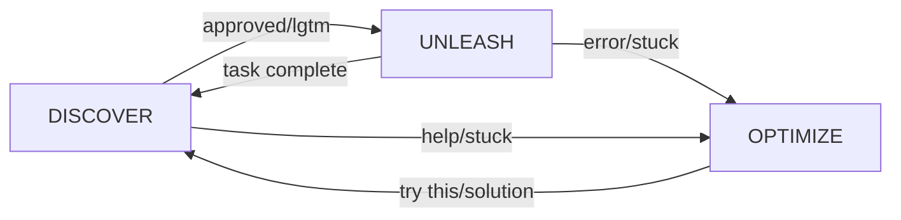

# 🧠 Understanding Cohesion States

> Deep dive into the DUO state system that powers Cohesion

## Overview

Cohesion implements a **DUO state machine** (Discover, Unleash, Optimize) that controls Claude's capabilities based on the current workflow phase. This creates predictable, safe, and efficient AI-assisted development.

## The DUO States

### 1. DISCOVER State 🔍

**Purpose**: Analysis, planning, and research phase

**Characteristics:**
- Default starting state
- Read-only access to filesystem
- Can analyze code and problems
- Can present plans and suggestions
- Cannot modify any files

**Available Tools:**
- ✅ Read - View file contents
- ✅ Grep - Search in files
- ✅ Glob - List files
- ✅ Bash - Read-only commands (ls, cat, grep, etc.)
- ❌ Write - Blocked
- ❌ Edit - Blocked
- ❌ MultiEdit - Blocked
- ❌ Destructive Bash - Blocked (rm, mv, etc.)

**Use Cases:**
- Understanding requirements
- Analyzing existing code
- Planning implementation approach
- Researching solutions
- Presenting options for approval

**Transitions:**
- → UNLEASH: User approval ("approved", "lgtm", "proceed")
- → OPTIMIZE: Need clarification or choice ("unclear", "which approach", "preference")

### 2. UNLEASH State ⚡

**Purpose**: Autonomous execution phase

**Characteristics:**
- Full tool access granted
- Can modify files and execute commands
- Implements approved plans
- Works independently
- Auto-returns to DISCOVER when complete

**Available Tools:**
- ✅ All tools available
- ✅ Write - Create files
- ✅ Edit - Modify files
- ✅ MultiEdit - Batch modifications
- ✅ Bash - All commands
- ✅ Git operations
- ✅ Package management

**Use Cases:**
- Implementing features
- Fixing bugs
- Running tests
- Refactoring code
- Setting up projects

**Transitions:**
- → DISCOVER: Task completion (automatic)
- → OPTIMIZE: Need user input (automatic detection or manual)

### 3. OPTIMIZE State 🤝

**Purpose**: Collaborative decision-making and alignment

**Characteristics:**
- Diagnostic tool access only
- Can read files and run read-only commands
- Awaiting user guidance or preference
- Processes user input when received
- Safe state for discussing choices and approaches

**Available Tools:**
- ✅ Read - View files for context
- ✅ Grep - Search for information
- ✅ Bash - Read-only commands for diagnostics
- ❌ Write/Edit - Blocked
- ❌ Modifications - Blocked

**Use Cases:**
- Multiple valid approaches exist
- Unclear requirements need clarification
- User preference matters for implementation
- Complexity beyond approved plan
- Overthinking detected - need redirection

**Transitions:**
- → DISCOVER: User provides solution ("try this", "here's how")
- → DISCOVER: Manual reset

## State Transitions

### Automatic Transitions



### Keyword Detection

**Approval Keywords** (DISCOVER → UNLEASH):
- "approved"
- "lgtm" (looks good to me)
- "proceed"
- "go ahead"
- "ship it"
- "yes proceed"

**Collaboration Keywords** (Any → OPTIMIZE):
- "stuck"
- "help"
- "blocked"
- "I'm confused"
- "not working"
- "error help"

**Solution Keywords** (OPTIMIZE → DISCOVER):
- "try this"
- "here's the solution"
- "the fix is"
- "you should"
- "attempt this"

### Manual Control

```bash
# Force state transitions
cohesion unleash   # → UNLEASH
cohesion discover  # → DISCOVER  
cohesion optimize  # → OPTIMIZE
cohesion reset     # → Fresh DISCOVER
```

## State Persistence

### Storage Location
```
.claude/state/
├── session.json       # Current state and metadata
├── history.log       # State transition history
├── tool-usage.log    # Tool access attempts
└── backups/         # Automatic backups
```

### Session Data Structure
```json
{
  "state": "DISCOVER",
  "session_id": "abc123",
  "started_at": "2024-01-01T10:00:00Z",
  "last_transition": "2024-01-01T10:05:00Z",
  "transition_count": 5,
  "duration_discover": 300,
  "duration_unleash": 120,
  "duration_optimize": 60,
  "tool_stats": {
    "Write": {"allowed": 5, "denied": 2},
    "Edit": {"allowed": 10, "denied": 3}
  }
}
```

### Persistence Rules

1. **Automatic Save**: State changes are saved immediately
2. **Session Recovery**: Restored on Claude Code restart
3. **TTL**: Sessions expire after 24 hours (configurable)
4. **Backup**: Last 5 states kept for recovery
5. **Atomic Writes**: Prevents corruption

## State Behavior Details

### DISCOVER Behavior

```bash
# What triggers DISCOVER
- Session start (default)
- Task completion in UNLEASH
- Solution received in OPTIMIZE
- Manual reset

# Typical duration
- 2-10 minutes for analysis
- 1-3 minutes for plan review
- 30 seconds for simple questions

# Best practices
- Let Claude fully analyze before approving
- Ask questions if plan unclear
- Request alternatives if needed
```

### UNLEASH Behavior

```bash
# What triggers UNLEASH
- Explicit approval from user
- Manual override via CLI

# Typical duration  
- 1-5 minutes for simple tasks
- 5-30 minutes for features
- 30+ minutes for complex implementations

# Auto-completion detection
- No more pending tasks
- Explicit completion message
- Error encountered
- User interruption
```

### OPTIMIZE Behavior

```bash
# What triggers OPTIMIZE
- User says "help" or "stuck"
- Claude detects it cannot proceed
- Manual CLI command
- Critical errors

# Resolution patterns
- User provides specific solution
- User gives alternative approach
- Manual state reset
- Session timeout (rare)
```

## Advanced State Patterns

### Pattern 1: Progressive Approval

```
DISCOVER → "show me phase 1" → DISCOVER
DISCOVER → "approved for phase 1 only" → UNLEASH
UNLEASH → completes phase 1 → DISCOVER
DISCOVER → "continue with phase 2" → UNLEASH
```

### Pattern 2: Guided Development

```
DISCOVER → present options → DISCOVER
User: "option 2 but with modifications"
DISCOVER → revised plan → DISCOVER
User: "approved"
DISCOVER → UNLEASH
```

### Pattern 3: Debugging Cycle

```
UNLEASH → error encountered → OPTIMIZE
User: "check the logs"
OPTIMIZE → DISCOVER
DISCOVER → analyzes logs → DISCOVER
User: "try fixing the import"
DISCOVER → presents fix → DISCOVER
User: "approved"
DISCOVER → UNLEASH
```

### Pattern 4: Learning Mode

```
OPTIMIZE → User: "here's how you do it..."
OPTIMIZE → DISCOVER
DISCOVER → "I understand, should I implement that?"
User: "yes"
DISCOVER → UNLEASH
```

## State Monitoring

### Real-time Monitoring
```bash
# Watch state changes
tail -f .claude/state/history.log

# Monitor tool usage
tail -f .claude/state/tool-usage.log

# Check current state
watch -n 1 cohesion status
```

### State Analytics
```bash
# Session statistics
cohesion stats

# State duration breakdown
grep "duration" .claude/state/session.json

# Transition frequency
grep -c "UNLEASH" .claude/state/history.log
```

## Customizing State Behavior

### Modify Allowed Tools
Edit `.claude/hooks/pre-tool-use.sh`:

```bash
case "$STATE" in
  DISCOVER)
    case "$TOOL" in
      Write|Edit)
        deny_tool "Cannot modify in DISCOVER"
        ;;
      YourCustomTool)
        # Add custom logic
        ;;
    esac
    ;;
esac
```

### Add Custom States
Advanced users can extend the state system:

```bash
# In state.sh
CUSTOM_STATES="REVIEWING TESTING DEPLOYING"

# Add transition logic
case "$NEW_STATE" in
  REVIEWING)
    # Custom reviewing state logic
    ;;
esac
```

### State Webhooks
```bash
# In post-state-change.sh
if [ "$NEW_STATE" = "UNLEASH" ]; then
  curl -X POST http://localhost:3000/webhook \
    -d "{\"state\": \"UNLEASH\", \"time\": \"$(date)\"}"
fi
```

## Troubleshooting States

### Common Issues

**Issue**: Stuck in DISCOVER
```bash
# Force transition
cohesion unleash

# Or use keyword
echo "approved" | nc localhost 5000
```

**Issue**: Can't leave OPTIMIZE
```bash
# Manual reset
cohesion reset

# Clear state file
rm .claude/state/session.json
cohesion reset
```

**Issue**: State not persisting
```bash
# Check permissions
ls -la .claude/state/

# Verify writes working
echo "test" > .claude/state/test
rm .claude/state/test
```

## Best Practices

### DO:
- ✅ Let Claude complete analysis in DISCOVER
- ✅ Review plans before approving
- ✅ Use clear transition keywords
- ✅ Check state when confused
- ✅ Reset if state seems wrong

### DON'T:
- ❌ Approve without reading the plan
- ❌ Use ambiguous keywords
- ❌ Force UNLEASH for exploration
- ❌ Ignore OPTIMIZE states
- ❌ Modify state files directly

## Summary

The three-state system provides:
1. **Safety** - No unauthorized modifications
2. **Control** - You decide when to execute
3. **Clarity** - Always know what phase you're in
4. **Recovery** - Easy to reset or intervene
5. **Efficiency** - Appropriate tools for each phase

---

**Next**: Learn about [Hooks System](HOOKS.md) →