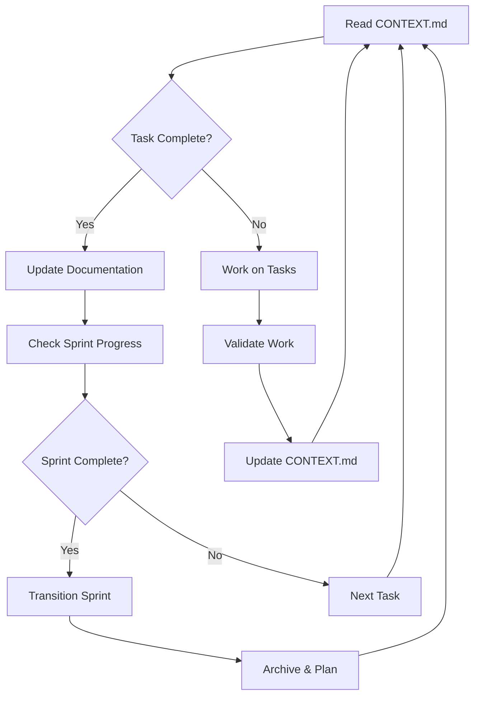

# 🔄 Development Workflow

## 🔄 The Self-Sustaining Loop



## 🎯 Daily Development Cycle

### Step 1: Session Start (< 1 minute)
```bash
# Check current state and context
cat docs/CONTEXT.md | head -30
cohesion status

# Review today's goals
grep "Priority" docs/CONTEXT.md
```

### Step 2: State-Based Workflow

#### Path A: DISCOVER State (Planning)
```bash
# Analyze the task
# Read relevant files
# Research approaches
# Present plan for approval

# Wait for "approved" or "lgtm"
```

#### Path B: UNLEASH State (Execution)
```bash
# Full tool access granted
# Implement approved plan
# Run tests
# Update documentation
# Commit changes
```

#### Path C: OPTIMIZE State (Need Help)
```bash
# Describe the blocker
# Wait for user guidance
# Process help when received
# Return to DISCOVER
```

### Step 3: Progress Documentation (5 minutes)
```bash
# Update CONTEXT.md with progress
# Update sprint tracking
# Commit changes
# Log decisions made
```

## 🚨 The Reality Check Protocol

### Never Accept Null Results
```javascript
// ❌ WRONG: Silent failure
const result = someFunction();
if (!result) {
  // Moving on silently
}

// ✅ RIGHT: Reality check
const result = someFunction();
if (!result) {
  console.log(`⚠️ UNEXPECTED NULL: someFunction()`);
  console.log(`📋 EXPECTED: valid result`);
  // Investigate immediately
}
```

### The 7-Step Reality Check
1. **Log the void** - Document what returned null
2. **Define expected** - What should have happened
3. **Isolate & test** - Test in minimal environment
4. **Find pattern** - What conditions cause failure
5. **Compare reality** - Expected vs actual
6. **System check** - Is this a broader issue?
7. **Escalate if needed** - Know when to ask for help

## 📋 Sprint Management

### Sprint Structure
```
sprints/
├── sprint-1-plan.md      # Planning document
├── sprint-1-retro.md     # Retrospective
└── current.md            # Symlink to active sprint
```

### Sprint Phases
- **Early (0-40%)**: Core implementation
- **Mid (40-80%)**: Integration & testing
- **Late (80-100%)**: Polish & documentation

### Sprint Transition
```bash
# Complete current sprint
cp docs/CONTEXT.md docs/sprints/sprint-N-complete.md

# Start next sprint
cp docs/sprints/sprint-N+1-plan.md docs/sprints/current.md

# Update context
sed -i '' 's/Sprint N/Sprint N+1/g' docs/CONTEXT.md

# Commit transition
git add . && git commit -m "chore: transition to Sprint N+1"
git tag sprint-N-complete
```

## 🧪 Testing Workflow

### Continuous Testing
```bash
# Before starting work
npm test -- --related

# During development
npm test -- --watch

# Before committing
npm test

# After implementation
npm run test:e2e
```

### Validation Gates
1. **Syntax** - Code must parse
2. **Types** - Type checking passes
3. **Lint** - Style rules pass
4. **Security** - No vulnerabilities
5. **Tests** - All tests green
6. **Performance** - Meets targets
7. **Documentation** - Updated
8. **Integration** - E2E tests pass

## 📊 Performance Validation

### Measure Everything
```bash
# Execution time
time npm run build

# Memory usage
/usr/bin/time -l npm run test

# Bundle size
du -sh dist/

# Record metrics
echo "Build: Xs, Memory: YMB" >> docs/metrics.log
```

## 🎯 Decision Framework

### Every 2 Hours Ask:
```
├─ On track for sprint goal?
│  ├─ YES → Continue
│  └─ NO → Adjust plan
│
├─ Quality maintained?
│  ├─ YES → Keep pace
│  └─ NO → Fix issues
│
├─ Tests passing?
│  ├─ YES → Safe to proceed
│  └─ NO → Fix first
│
└─ Documentation current?
   ├─ YES → Good practice
   └─ NO → Update now
```

## 🔥 Emergency Procedures

### State Issues
```bash
# Reset to DISCOVER
cohesion reset

# Force state change
cohesion unleash

# Check state file
cat .claude/state/session.json
```

### Build Issues
```bash
# Clean everything
rm -rf node_modules dist
npm install
npm run build
```

### Git Issues
```bash
# Stash and reset
git stash
git reset --hard HEAD
git stash pop
```

## ✅ Definition of Done

Task is complete when:
- ✓ Feature works as specified
- ✓ Tests pass (unit + integration)
- ✓ No regression in existing features
- ✓ Performance targets met
- ✓ Documentation updated
- ✓ Code reviewed (self or peer)
- ✓ CONTEXT.md reflects current state

## 📝 Best Practices

1. **Small commits** - Commit every 1-2 hours
2. **Test continuously** - Never skip tests
3. **Document immediately** - While context is fresh
4. **Validate often** - Check against requirements
5. **Use Reality Check** - Never ignore nulls
6. **Update CONTEXT.md** - Single source of truth
7. **Follow state flow** - DISCOVER → UNLEASH → OPTIMIZE

## 🔗 Related Documents

- [Context](./CONTEXT.md) - Current project state
- [Commands](./COMMANDS.md) - Available commands
- [Sprints](./sprints/) - Sprint documentation
- [Patterns](./patterns/) - Code patterns

---
*This workflow ensures sustainable, long-term project development*