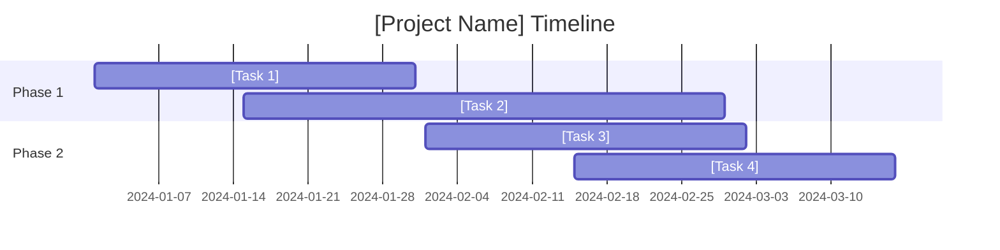

# [Project Name] - Comprehensive Project Plan

## Executive Overview

**Project:** [Project Name] - [Brief Description]  
**Duration:** [X-Y weeks/months]  
**Methodology:** [Agile/Waterfall/etc] with [sprint length]  
**Team Size:** [N engineers/people]  
**Budget:** [Budget details or "TBD"]

### Strategic Objectives
1. **[Objective 1]**: [Description and target]
2. **[Objective 2]**: [Description and target] 
3. **[Objective 3]**: [Description and target]
4. **[Objective 4]**: [Description and target]

### Success Metrics
- **[Metric 1]**: [Target value and description]
- **[Metric 2]**: [Target value and description]
- **[Metric 3]**: [Target value and description]

## Project Phases

### Phase 1: [Phase Name] ([Duration])
**Objective**: [What this phase accomplishes]

**Key Deliverables:**
- [ ] [Deliverable 1]
- [ ] [Deliverable 2]
- [ ] [Deliverable 3]

**Success Criteria:**
- [Criterion 1]
- [Criterion 2]

### Phase 2: [Phase Name] ([Duration])
**Objective**: [What this phase accomplishes]

**Key Deliverables:**
- [ ] [Deliverable 1]
- [ ] [Deliverable 2]
- [ ] [Deliverable 3]

**Success Criteria:**
- [Criterion 1]
- [Criterion 2]

### Phase 3: [Phase Name] ([Duration])
**Objective**: [What this phase accomplishes]

**Key Deliverables:**
- [ ] [Deliverable 1]
- [ ] [Deliverable 2]
- [ ] [Deliverable 3]

**Success Criteria:**
- [Criterion 1]
- [Criterion 2]

## Risk Management

### High Risk Items
| Risk | Impact | Probability | Mitigation Strategy |
|------|--------|-------------|-------------------|
| [Risk 1] | [High/Med/Low] | [High/Med/Low] | [Strategy] |
| [Risk 2] | [High/Med/Low] | [High/Med/Low] | [Strategy] |

### Dependencies
- **External**: [External dependencies]
- **Internal**: [Internal dependencies]
- **Technical**: [Technical dependencies]

## Resource Planning

### Team Structure
- **[Role 1]**: [Name/TBD] - [Responsibilities]
- **[Role 2]**: [Name/TBD] - [Responsibilities]
- **[Role 3]**: [Name/TBD] - [Responsibilities]

### Tools & Infrastructure
- **Development**: [Tools list]
- **Testing**: [Testing tools]
- **Deployment**: [Deployment tools]
- **Monitoring**: [Monitoring tools]

## Timeline

## Quality Assurance

### Testing Strategy
- **Unit Tests**: [Coverage target and approach]
- **Integration Tests**: [Approach and key scenarios]
- **Performance Tests**: [Benchmarks and targets]
- **User Acceptance**: [Process and criteria]

### Quality Gates
- [ ] All unit tests passing
- [ ] Performance benchmarks met
- [ ] Security review completed
- [ ] Documentation complete

## Communication Plan

### Stakeholders
| Stakeholder | Role | Communication Frequency |
|-------------|------|------------------------|
| [Name/Role] | [Sponsor/User/etc] | [Weekly/Bi-weekly/etc] |

### Reporting
- **Status Updates**: [Frequency and format]
- **Demo Schedule**: [When and to whom]
- **Documentation**: [What and when]

## Success Criteria & Definition of Done

### Project Success
- [ ] All phase deliverables completed
- [ ] Success metrics achieved
- [ ] Quality gates passed
- [ ] Stakeholder acceptance received

### Individual Feature DoD
- [ ] Requirements implemented
- [ ] Tests written and passing
- [ ] Code reviewed and merged
- [ ] Documentation updated
- [ ] Deployed and verified

---

**Document Status**: [Draft/In Review/Approved]  
**Last Updated**: [Date]  
**Next Review**: [Date]